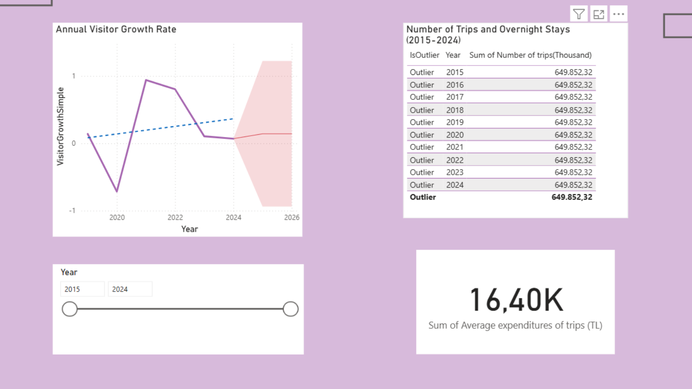
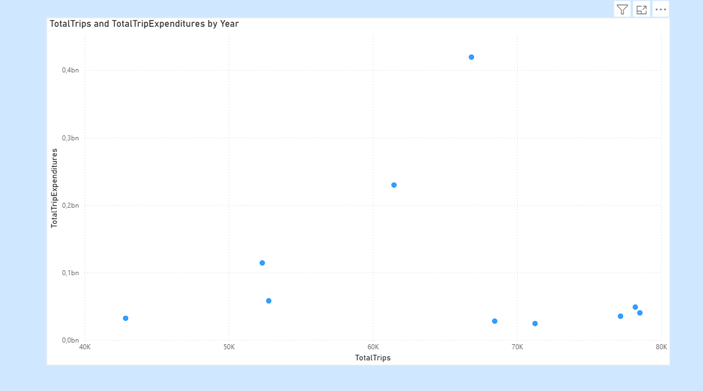
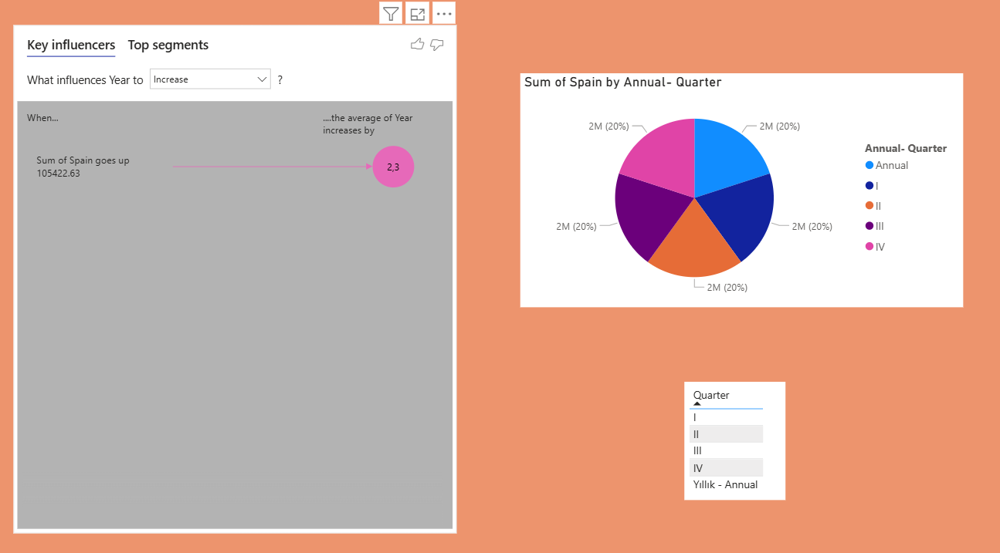

# 📊 Tourism Insights in Turkey (2015–2024) - Power BI Portfolio

This repository showcases an end-to-end Business Intelligence project analyzing Turkey’s tourism data from 2015 to 2024, utilizing official TÜİK (Turkish Statistical Institute) statistics[cite: 3].

## 🛠️ Methodology & Technical Stack
- **Data Preparation & Cleaning:** Harmonized multiple datasets (tourism income, visitor counts, overnight stays, and accommodation types) using Power Query to handle missing values, standardize column names, and align temporal structures[cite: 3].
- **Data Modeling:** Built a robust relational data model in Power BI based primarily on the ‘Year’ field, resolving many-to-many cardinality challenges for seamless cross-table analysis[cite: 3].
- **Advanced DAX Calculations:** Developed custom measures including Annual Visitor Growth Rate, Total/Average Overnight Stays, and statistical outlier detection measures[cite: 3].
- **Interactive Visualizations:** Implemented Line Charts, Summary Tables, Key Influencer visuals, and dynamic Slicers/Filters[cite: 3].

---

## 📈 Dashboard Previews & Visualizations

### 1. Annual Visitor Growth & Summary Statistics
Analyzes visitor growth trends over time alongside summary metrics and outlier detection across years (2015–2024)[cite: 3].

### 2. Correlation Analysis: Total Trips vs. Total Trip Expenditures
Scatter plot visualizing the relationship between total trips and total expenditures by year[cite: 3].

### 3. Key Influencers & Quarterly Breakdown
Explores factors influencing year-over-year increases (such as visitor data from Spain) alongside annual and quarterly distribution breakdowns[cite: 3].
# business-intelligence-portfolios
